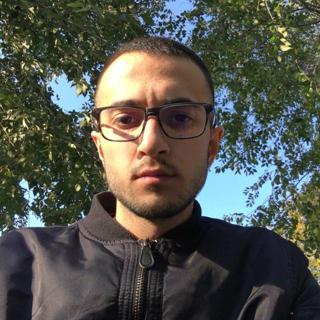

Hello. My name is Nemanja Vlahović.
I'm a 24-year-old & iOS developer currently living in Belgrade with a passion for music, art and technology.
More information can be found through [LinkedIn](http://www.linkedin.com/in/nemanjavlahovic).

I currently work at [mySkin inc](https://www.myskin.com) building the iOS app used for interacting with beautiful skin-scanning device called OKU.

When I'm not programming, I love to make music, mostly ambient these days. You can check it out on [Soundcloud](https://soundcloud.com/subsidedmusic).

### Social

- [Twitter](http://twitter.com/_manjane) — say hi
- [GitHub](https://github.com/nemanjavlahovic) — code
- [Instagram](http://instagram.com/_subsided/) — stories spam, beware
- [Soundcloud](https://soundcloud.com/subsidedmusic) — my music
- [Facebook](http://www.facebook.com/nemanjavlahovic)
